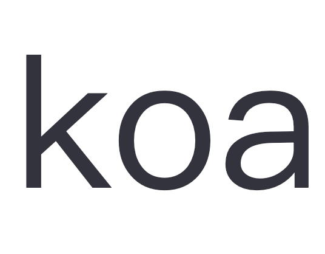
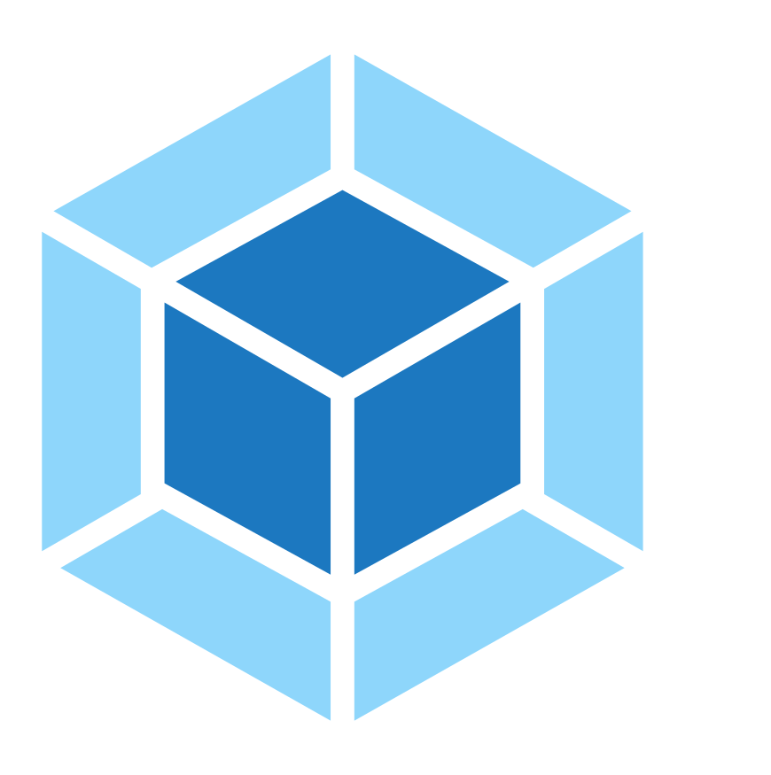

  

 

<h3>Hi there, I'm ShineShao! 👋</h3>

 

  <!-- https://github.com/anuraghazra/github-readme-stats --> 
 <picture>
  <source 
    srcset="https://github-readme-stats.vercel.app/api?username=freeshineit&show_icons=true&count_private=true&include_all_commits=true&theme=dark"
    media="(prefers-color-scheme: dark)"
  />
  <source
    srcset="https://github-readme-stats.vercel.app/api?username=freeshineit&show_icons=true&count_private=true&include_all_commits=true"
    media="(prefers-color-scheme: light), (prefers-color-scheme: no-preference)"
  />

</picture>

<picture>
  <source 
    srcset="https://github-readme-stats.vercel.app/api/top-langs/?username=freeshineit&show_icons=true&theme=dark&langs_count=8&layout=compact&hide=python"
    media="(prefers-color-scheme: dark)"
  />
  <source
    srcset="https://github-readme-stats.vercel.app/api/top-langs/?username=freeshineit&show_icons=true&langs_count=8&layout=compact&hide=python"
    media="(prefers-color-scheme: light), (prefers-color-scheme: no-preference)"
  />
  
</picture>
 

<!--  -->

<h3 align="left">Languages and Tools:</h3>

 

### 💻 Ask me about

- FE Development
   
   
  
    
    
    
    
    
    
    
    
    
    
    
    
    
    
    

- Tools 🔧
  
  
  
  
  

### 🌱 I’m currently learning ...

  
  
  

<!--
**freeshineit/freeshineit** is a ✨ _special_ ✨ repository because its `README.md` (this file) appears on your GitHub profile.

Here are some ideas to get you started:

- 🔭 I’m currently working on ...
- 👯 I’m looking to collaborate on ...
- 🤔 I’m looking for help with ...
- 💬 Ask me about ...
- 📫 How to reach me: ...
- 😄 Pronouns: ...
- ⚡ Fun fact: ...
-->
