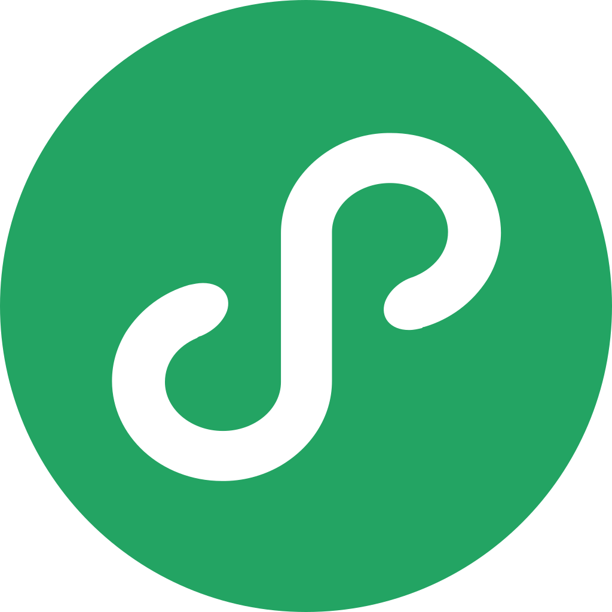
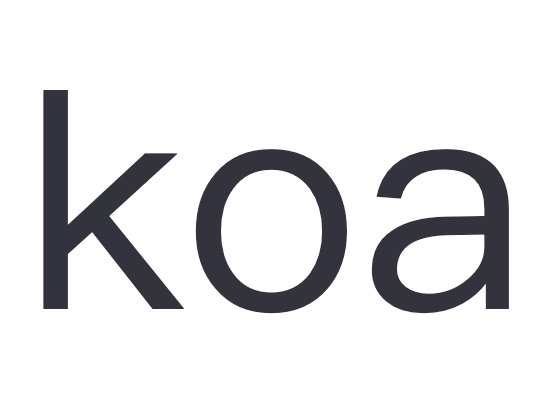
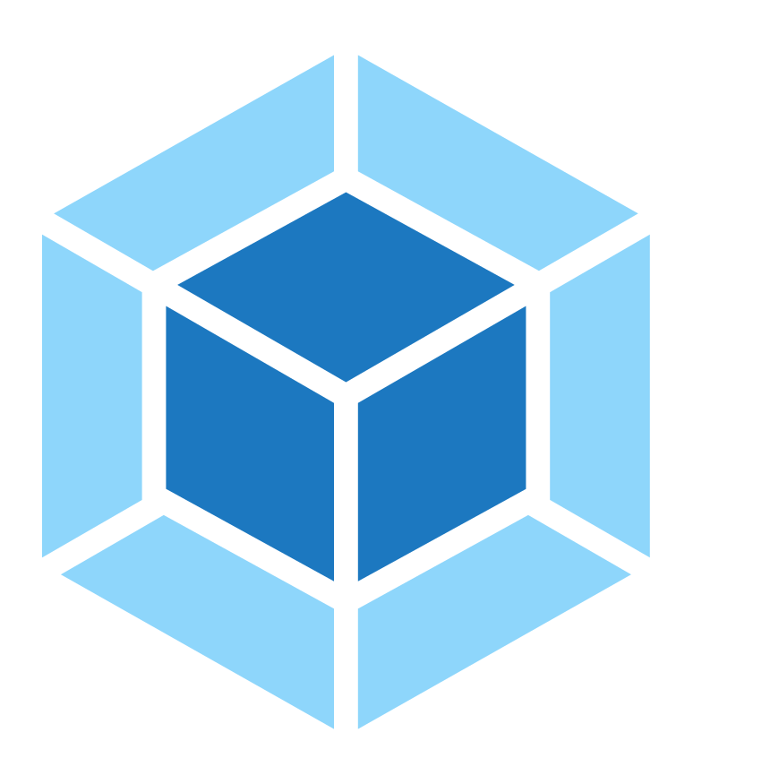

  

  # Hi there, I'm ShineShao 👋

  

    
    
    
  

  
<em>A passionate Front-End Developer who loves building things for the web 🚀</em>

---

## 📊 GitHub Metrics

<table>
  <tr>
    <td align="center" width="50%">
        <picture>
          <source
            srcset="https://github-readme-stats.vercel.app/api/top-langs/?username=freeshineit&show_icons=true&theme=dark&langs_count=8&layout=compact&hide=python&hide_border=true"
            media="(prefers-color-scheme: dark)"
          />
          <source
            srcset="https://github-readme-stats.vercel.app/api/top-langs/?username=freeshineit&show_icons=true&langs_count=8&layout=compact&hide=python&hide_border=true"
            media="(prefers-color-scheme: light), (prefers-color-scheme: no-preference)"
          />
          
      </picture>
    </td>
    <td align="center" width="50%">
      <picture>
        <source
          srcset="https://github-readme-stats.vercel.app/api?username=freeshineit&show_icons=true&count_private=true&include_all_commits=true&theme=dark&hide_border=true"
          media="(prefers-color-scheme: dark)"
        />
        <source
          srcset="https://github-readme-stats.vercel.app/api?username=freeshineit&show_icons=true&count_private=true&include_all_commits=true&hide_border=true"
          media="(prefers-color-scheme: light), (prefers-color-scheme: no-preference)"
        />
        
      </picture>
    </td>
  </tr>
</table>

## 🧩 Tech Stack

<table>
  <tr>
    <th align="left">💻 Front-End</th>
    <th align="left">🔧 Tools</th>
    <th align="left">🌱 Learning</th>
  </tr>
  <tr>
    <td valign="top">
      
      
      
      
      
      
       
      
      
      
      
      
       
      
      
      
      
    </td>
    <td valign="top">
      
      
      
      
      
    </td>
    <td valign="top">
      
      
      
    </td>
  </tr>
</table>

📈 More GitHub Stats

 

<picture>
  <source
    srcset="https://github-readme-streak-stats.herokuapp.com?user=freeshineit&theme=dark&ring=10b981&fire=10b981&currStreakLabel=ffffff&card_width=800&hide_border=true"
    media="(prefers-color-scheme: dark)"
  />
  <source
    srcset="https://github-readme-streak-stats.herokuapp.com?user=freeshineit&theme=default&ring=059669&fire=059669&currStreakLabel=0f172a&card_width=800&hide_border=true"
    media="(prefers-color-scheme: light), (prefers-color-scheme: no-preference)"
  />
  
</picture>

---

  Generated with ❤️ by ShineShao

